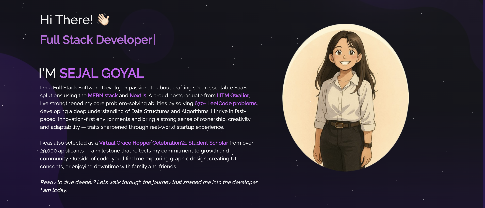
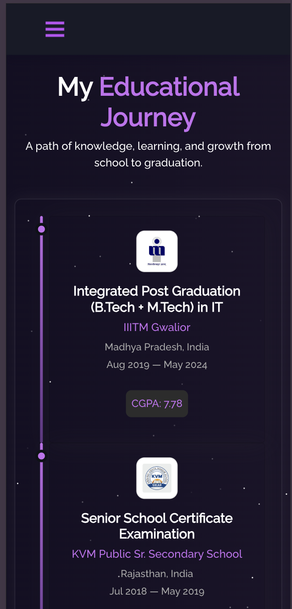

# 💻 Sejal Goyal's Personal Portfolio

Welcome to my personal portfolio website built with **React.js** and **React-Bootstrap**!  
This site highlights my experience, projects, skills, and achievements as a Software Developer.

<!-- 🌐 Live Demo: [https://sejalgoyal.dev](https://sejalgoyal.dev)  -->
<!-- replace with your live link if available -->

---

## ✨ Features

- Responsive, elegant UI built with React.js
- Showcases my:
  - 🧠 Skills
  - 💼 Experience
  - 📚 Education
  - 🚀 Projects
  - 🏆 Achievements
  - 👥 Volunteering Positions
- Modern navigation with scroll-based sectioning
- Interactive elements and social media integration
- One-click email copy feature
- Clean animations and component structure

---

## 🛠️ Tech Stack

- **React.js**
- **React-Bootstrap**
- **JavaScript (ES6+)**
- **HTML5 & CSS3**
- **React Icons**
- **React Router DOM**
- **Git & GitHub**

---

## 📸 Screenshots

| Desktop View                           | Mobile View                          |
| -------------------------------------- | ------------------------------------ |
|  |  |

---

## 🧩 Installation & Local Setup

```bash
# 1. Clone the repository
git clone git@github.com:sejal8745/MyPortfolio.git

# 2. Navigate into the project folder
cd MyPortfolio

# 3. Install dependencies
npm install

# 4. Start the development server
npm start
```

## 📫 Contact

Feel free to connect with me:

- ✉️ Email: [sejal.goyal.dev@gmail.com](mailto:sejal.goyal.dev@gmail.com)
- 💼 [LinkedIn](https://www.linkedin.com/in/sejal-goyal-437015194/)
- 💻 [GitHub](https://github.com/sejal8745)
- 🧠 [Leetcode](https://leetcode.com/u/sejal8745/)
